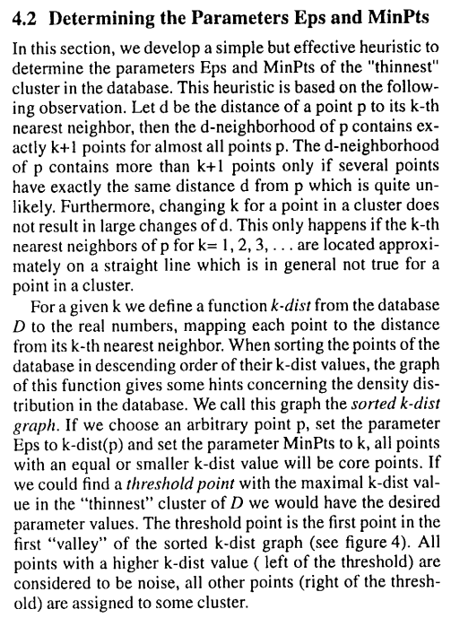

## Context:

DBSCAN (Density-Based Spatial Clustering of Applications with Noise): Is a popular clustering algorithm used in data mining and machine learning. It's particularly useful for clustering applications where the clusters have irregular shapes and varying densities. Let's address your questions one by one

https://www.youtube.com/watch?v=RDZUdRSDOok

### a. In which cases might it be more useful to apply?

1. Irregularly Shaped Clusters: DBSCAN can identify clusters of arbitrary shapes, unlike some other clustering algorithms like K-means, which assume spherical clusters.

2. Variable Density Clusters: It can handle clusters with varying densities. It doesn't assume that all clusters have the same density, making it suitable for data where the density varies across the feature space.

3. Noise Tolerance: DBSCAN is capable of identifying noise points, which are data points that don't belong to any cluster. This is important in real-world datasets where noisy data can be prevalent.

4. No Prior Knowledge of Cluster Number: Unlike K-means, DBSCAN doesn't require you to specify the number of clusters beforehand. It can discover the number of clusters automatically from the data.

5. Spatial Data: DBSCAN is often used in geographic information systems (GIS) and image analysis because it takes into account the spatial distribution of data points.

### b. What are the mathematical fundamentals of it?

The core idea behind DBSCAN is to identify clusters based on the density of data points in the feature space. Here are the key mathematical fundamentals:

1. Density: DBSCAN defines two important parameters: epsilon (ε) and MinPts. Epsilon is the radius within which the algorithm searches for neighboring data points, and MinPts is the minimum number of data points required within this radius to consider a point as a core point.

2. Core Point: A data point is considered a core point if there are at least MinPts data points (including itself) within a distance of epsilon from it.

3. Border Point: A data point is considered a border point if it is within the epsilon distance of a core point but doesn't have enough neighboring data points to be a core point itself.

4. Noise Point: Any data point that is neither a core point nor a border point is considered a noise point.

5. Cluster Formation: DBSCAN starts with an arbitrary unvisited data point and explores its neighborhood. If it's a core point, it starts forming a cluster by recursively exploring the neighborhood of core points. Border points are assigned to the cluster, and this process continues until no more points can be added to the cluster.

6. Cluster Separation: Clusters are separated by noise points, which act as natural boundaries. If a point is not reachable from any core point, it's treated as noise.

### c. Is there any relation between DBSCAN and Spectral Clustering? If so, what is it?

DBSCAN and Spectral Clustering are both clustering techniques, but they have different approaches and purposes:

**DBSCAN**: As discussed earlier, DBSCAN is a density-based clustering algorithm. It identifies clusters based on the density of data points. It is suitable for finding clusters of varying shapes and densities in spatial data.

**Spectral** Clustering: Spectral Clustering, on the other hand, is a graph-based clustering algorithm. It doesn't directly consider the density of data points but instead focuses on the affinity or similarity between data points. It transforms the data into a graph representation and then applies graph partitioning techniques to identify clusters. However...

Spectral clustering and DBSCAN are two famous clustering methods, the former reduces data dimensionality by spectrum of similarity matrix, and then utilizes kmeans to cluster data in low dimensional space. While DBSCAN performs clustering by finding different density regions that depart from each other, which makes it seems quite different from spectral clustering, and there is little literal discusses the relationship between them. In this paper, we revisit DBSCAN from Similarity Graph and Graph Cut point of views, uncover the underlying relationship between DBSCAN and spectral clustering, which proves that DBSCAN can be explained and rewritten under the framework of spectral clustering. Furthermore, eigenvectors are often approximately resolved, and k-means is usually used in the final stage, often converges in local optimization. Hence, we rewrite spectral clustering by using nearest neighbor query instead of k-means to obtain exact result. Experimental results address that the revised spectral clustering method can obtain the same result as DBSCAN on core point set. Therefore, we come to the conclusion that DBSCAN is semi-spectral clustering [...].

Y. Chen, "DBSCAN Is Semi-Spectral Clustering," 2020 6th International Conference on Big Data and Information Analytics (BigDIA), Shenzhen, China, 2020, pp. 257-264, doi: 10.1109/BigDIA51454.2020.00048.
