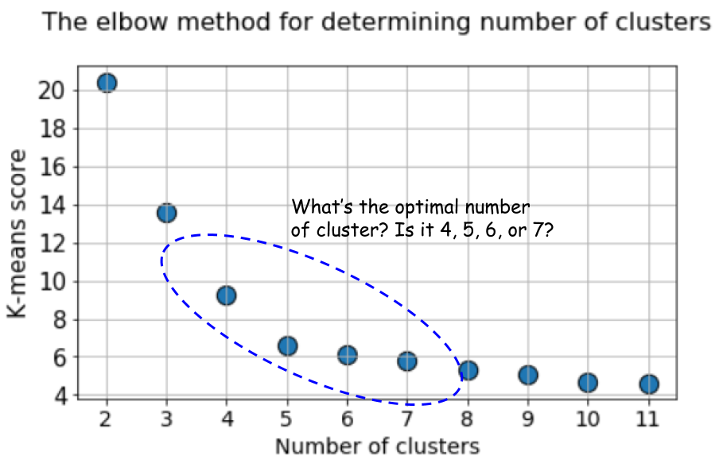

## Context:

### What is the elbow method in clustering? And which flaws does it pose to assess quality?

The elbow method is a heuristic method of interpretation and validation of consistency within cluster analysis designed to help find the appropriate number of clusters in a dataset. It is ambiguous and not very reliable, because it is based on the idea that the optimal number of clusters can be found at the point where the curve shows an "elbow". This is not always the case, as shown in the figure below.

It helps in finding the "elbow point" on a plot of the number of clusters (k) against the within-cluster sum of squares (WCSS) or the cost function. The WCSS measures the sum of squared distances between data points and their assigned cluster centroids. The idea behind the elbow method is to select a value of k where the decrease in WCSS starts to slow down, creating an "elbow" shape on the plot. This is because, as the number of clusters increases, the WCSS value will start to decrease more slowly, and at some point, the rate of decrease will become very small, resulting in an elbow shape in the graph.

However, the elbow method has its limitations and potential flaws:

1. It is not always clear where the elbow is on the plot, and it can be subjective to interpret the results.
2. It is not always possible to find a clear elbow, especially if the data is not very clustered. In datasets with a lot of noise or irregular shapes, it may be challenging to identify a clear elbow point, making the method less effective.
3. Sensitivity to Initialization: The choice of the initial cluster centroids can affect the results of the elbow method. Different initializations may lead to different "elbows."
4. Misleading Elbows: In some cases, the elbow method can suggest an elbow point that does not necessarily correspond to the true optimal number of clusters. It may lead to suboptimal clustering solutions.
5. Validity of the Assumption: The elbow method assumes that the clusters are spherical and have approximately the same size and density, which may not hold true for all datasets.