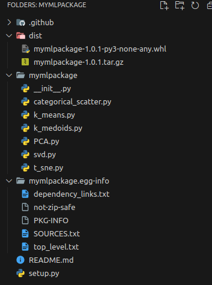

Remember the unsupervised Python package you created in the previous unit? It’s
time for an upgrade. a. Implement the k-means module using Python and Numpy b.
Implement the k-medoids module using Python and Numpy c. Remember to keep
consistency with Scikit-Learn API as high as possible

[Pypi: My ML custom package](https://pypi.org/project/mymlpackage/#description)

[GitHub: mymlpackage](https://github.com/lmbd92/mymlpackage)

