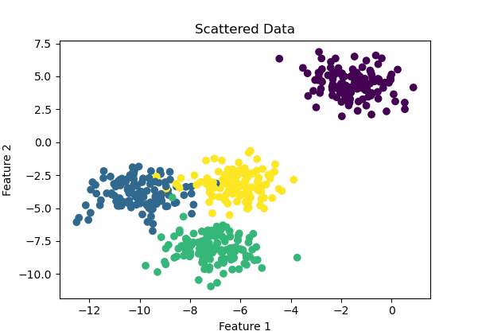

## Exercise 5. Unsupervised learning

Let’s use the newly created modules in unsupervised to cluster some toy data.
a. Use the following code snippet to create scattered data X
```python
from sklearn.datasets import make_blobs
X, y = make_blobs(
n_samples=500,
n_features=2,
centers=4,
cluster_std=1,
center_box=(-10.0, 10.0),
shuffle=True,
random_state=1,
)
```
b. Plot the resulting dataset. How many clusters are there? How far are they from one another?

- By looking at the plot, we can estimate the number of clusters and their distances from one another. In this case, there are 4 clusters, and we can see how far apart they are.



c. For both k-means and k-medoids (your implementations), calculate the silhouette plots and
coefficients for each run, iterating K from 1 to 5 clusters.
d. What number of K got the best silhouette score? What can you say about the figures? Is this the
expected result?