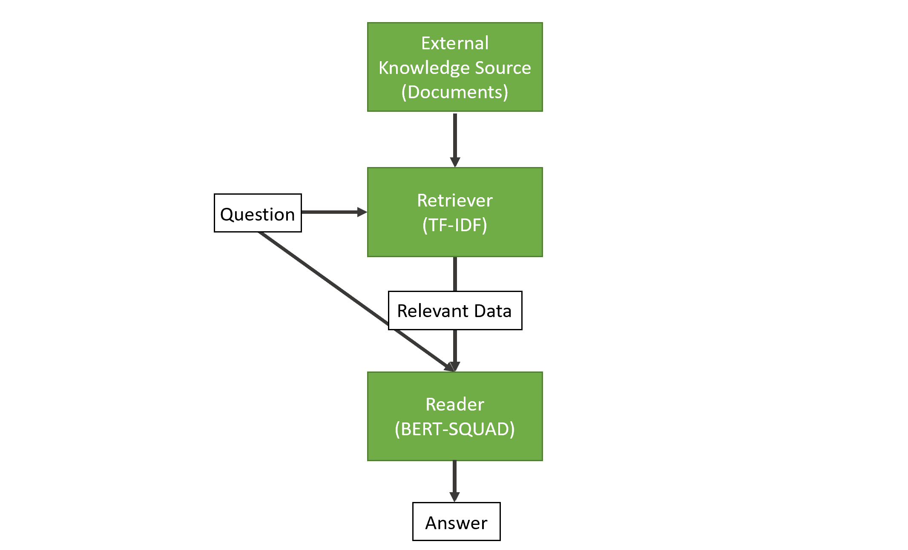

# Q&A System implementation

NoteBook: [punto3.ipynb](punto3.ipynb)

The following is the architecture of the Q&A system to implement:



### Setup

```python
!pip install transformers
!pip install datasets
import torch
```

# How tu use the Q&A system

In your terminal from the root of the "Taller3" folder run the following
command:

- Option 1:

```python
python punto3.py
```

- Option 2:

* Execute block by block the notebook [punto3.ipynb](punto3.ipynb)
